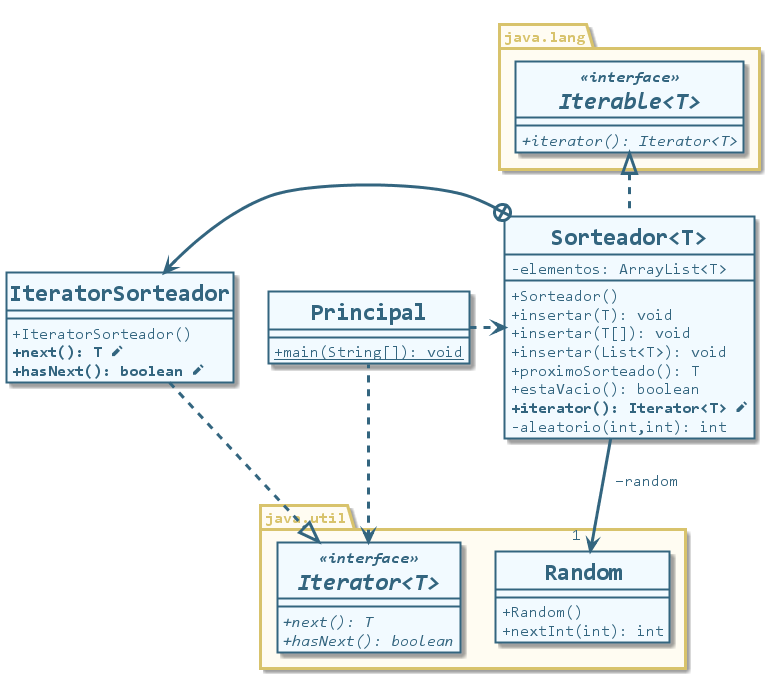

# Iterable e Iterator en Java

## Descripción

Ejemplo de funcionamiento de las interfaces `Iterable` e `Iterator` en Java.
Sobre una colección propia llamada `Sorteador` se implementa la interfaz `Iterable` que obliga a sobreescribir el método `iterator()`, el cual debe retornar un objeto de tipo `Iterator`.
Se crea una clase interna llamada `IteratorSorteador` que implementa la interfaz `Iterator`, la cual obliga a sobreescribir los métodos `next()` y `hasNext()`. Éstos permiten iterar cualquier colección sin conocer su estructura.

Suponiendo tener un sorteador de cadenas:

```java
Sorteador<String> miSorteador = new Sorteador<String>();
```

Hay dos maneras de iterarlo:

### Obteniendo un iterador 

```java
Iterator it = miSorteador.iterator(); // Pido un iterador al sorteador
while (it.hasNext()) { // Mientras haya siguiente
	System.out.println(it.next()); // Mostrar siguiente
}
```
### Utilizando la estructura `foreach`

```java
for (String elemento : miSorteador) { // Para cada 'elemento' de tipo 'String' en la colección 'miSorteador'
    System.out.println(elemento); // Mostrar 'elemento'
}
```
## Diagrama de clases



Proyecto realizado con NetBeans 8.2. Compatible con Eclipse.