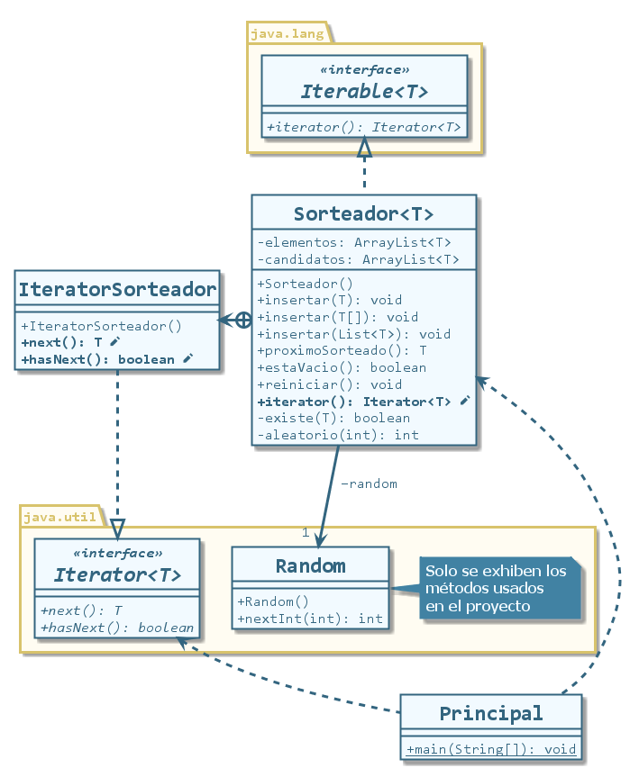

# Iterable e Iterator en Java

## Descripción

Ejemplo de funcionamiento de las interfaces `Iterable` e `Iterator` en Java.
Sobre una colección propia llamada `Sorteador` se implementa la interfaz `Iterable` que obliga a sobreescribir el método `iterator()`, el cual debe retornar un objeto de tipo `Iterator`.
Se crea una clase interna llamada `IteratorSorteador` que implementa la interfaz `Iterator`, la cual obliga a sobreescribir los métodos `next()` y `hasNext()`. Éstos permiten iterar cualquier colección sin conocer su estructura.

Simplemente se escribe:

```java
Iterator it = miSorteador.iterator(); // Pido un iterador al sorteador
while (it.hasNext()) {
    System.out.println( it.next() );
}
```
O:

```java
for (String sorteado : miSorteador) {
    System.out.println( sorteado );
}
```
## Diagrama de clases

Las dependencias de la clase Principal no son mostradas para simplificar el diagrama.


Proyecto realizado con Eclipse IDE.
