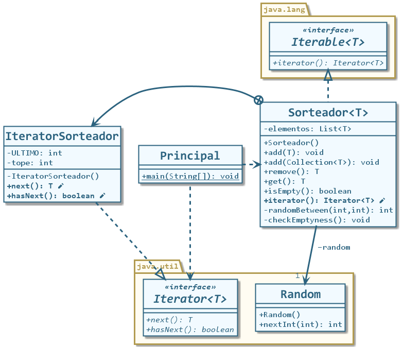

# Iterable e Iterator en Java

## Descripción

Ejemplo de funcionamiento de las interfaces `Iterable` e `Iterator` en Java.

Sobre una colección propia llamada `Sorteador` se implementa la interfaz `Iterable` que obliga a sobreescribir el método `iterator()`, el cual debe retornar un objeto `Iterator`.

Como `Iterator` es una interfaz, se crea una clase interna en la clase `Sorteador` llamada `IteratorSorteador` que implementa `Iterator`. Esta interfaz obliga a sobreescribir los métodos `next()` y `hasNext()`, cuyas firmas pueden observarse en el diagrama de clases o el código del proyecto.

**Una colección iterable permite poder iterarla sin conocer sus detalles de implementación.**

Suponiendo tener un sorteador de cadenas:

```java
Sorteador<String> miSorteador = new Sorteador<String>();
```

Podría iterarse sabiendo cómo funcionan los sorteadores:

```java
while (!miSorteador.estaVacio()) {
    System.out.println(miSorteador.proximoSorteado());
}
```

Sin embargo, hay dos maneras de iterarlo sin conocer sus detalles de implementación ni el nombre de sus métodos:

### Obteniendo un iterador 

```java
Iterator<String> it = miSorteador.iterator(); // Pido un iterador al sorteador
while (it.hasNext()) { // Mientras haya siguiente
	String elemento = it.next(); // Guardar siguiente en 'elemento'
	System.out.println(elemento); // Mostrar 'elemento'
}
```
### Utilizando la estructura `foreach`

```java
for (String elemento : miSorteador) { // Para cada 'elemento' de tipo 'String' en la colección 'miSorteador'
    System.out.println(elemento); // Mostrar 'elemento'
}
```
## Diagrama de clases



Proyecto realizado con NetBeans 8.2. Compatible con Eclipse.